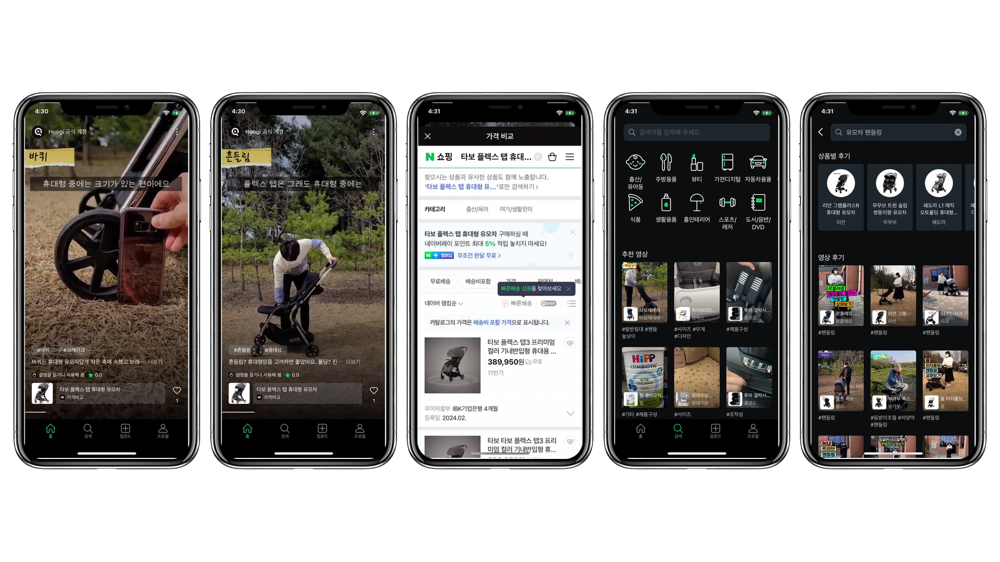

# app-mockup — 앱 스크린샷 기기 목업 생성

앱 스크린샷(또는 화면 녹화 영상에서 뽑은 프레임)을 아이폰/갤럭시 목업 프레임에 합성해, 배경이 투명한 1920x1080 이미지 한 장으로 만들어준다.

### 예시
아이폰 XS 실물 목업 프레임에 5장을 합성한 결과 (배경 투명, 1920x1080):

## 워크플로우

0. **작업 시작 전, 이번 메시지 자체에 이미 담긴 정보부터 빠짐없이 확인한다.** `/app-mockup` 커맨드는 인자(ARGUMENTS) 텍스트와 별개로 이미지가 같은 메시지에 인라인으로 함께 첨부되는 경우가 흔하다 — 인자 텍스트만 보고 "첨부 없음"이라고 섣불리 판단하지 말고, 메시지 본문 전체(인라인 이미지 포함)를 다시 확인한 뒤에 없다고 결론짓는다. 이미지뿐 아니라 **기종 정보(예: "아이폰 16 Pro로", "갤럭시 S24 검정"), 목업 방식(실물 프레임/CSS 근사), 홈바·네비게이션 바 제거 여부 같은 옵션도 같은 메시지의 인자·본문에 이미 적혀 있을 수 있다** — 이런 정보가 이미 명시돼 있으면 2번 질문 배치에서 해당 항목을 빼고 그대로 사용한다 (모호하거나 특정이 안 된 부분만 골라서 질문한다). 이번 요청에 이미지/영상이 정말 전혀 첨부되어 있지 않다면, 이전 대화나 폴더 안에서 파일을 임의로 찾아 쓰지 않고 사용자에게 원본으로 쓸 이미지나 영상을 첨부해달라고 요청한다. 첨부가 있어도 여러 개이거나 어떤 것을 원본으로 써야 할지 모호한 경우에는, 어떤 파일을 쓸지와 필요하면 어떤 화면/기능을 스크린샷으로 뽑을지 사용자에게 먼저 확인받는다. 폴더 안 파일을 임의로 추정해서 바로 프레임 추출이나 스크린샷 작업을 시작하지 않는다.
1. 확인된 이미지나 영상을 보고 핵심 기능을 파악해 앱 스크린샷을 추출, 사용자에게 저장 가능하도록 보낸다. (앱 자체 탭바는 유지) 이 단계에서 뽑힌 스크린샷을 바로 훑어봐서 하단에 갤럭시 네비게이션 바나 아이폰 홈 인디케이터가 실제로 보이는지 미리 확인해둔다 (다음 단계 질문 구성에 필요).
2. **아직 확정 안 된 항목만 골라서, 반드시 AskUserQuestion 한 번의 호출로 전부 모아서 묻는다.** 기기 질문 따로, 기종 질문 따로, 홈바 질문 따로 — 이런 식으로 여러 차례 나눠 왕복하지 않는다. 0번에서 이미 답이 나온 항목은 배치에서 제외한다.
   1. **기기+기종 (하나의 질문으로 동시에 확정)**: 옵션 예시 — "아이폰(최신 기종)" / "갤럭시(최신 기종)" / "기타 기기". 특정 기종을 원하면 옵션을 고르는 대신 "Other"로 기종명(예: "아이폰 XS", "갤럭시 S23")을 직접 입력하게 한다.
   2. **목업 방식 (사용자가 직접 선택)**: "실물 기기 프레임 우선 검색" — 웹에서 실제 기기 사진 기반 프레임을 찾아 노치·카메라·베젤을 정확히 재현하고, 못 찾을 때만 자동으로 [브라우저 자동화 목업 서비스]→[CSS 근사] 순서로 폴백 / "CSS 근사(씬 베젤) 바로 사용" — 검색 없이 빠르게 손으로 근사한 프레임으로 바로 진행 (기종별 실사 디테일은 없음).
   3. **하단 요소 제거 여부** — 1번에서 뽑은 스크린샷에 실제로 해당 요소가 보일 때만 이 질문을 포함한다 (없으면 질문 자체를 생략): 갤럭시라면 뒤로가기 화살표 등 네비게이션 바, 아이폰이라면 홈 인디케이터(홈바)를 유지할지 제거할지.
3. 2-2번 답변이 "실물 기기 프레임 우선"이고 기종이 특정된 경우(예: "아이폰 XS", "갤럭시 S23"), 아래 우선순위로 실물 목업을 확보한다:
   1. **1차**: [실물 기기 프레임 에셋 사용] — 스크린 영역이 알파 투명으로 뚫린 프레임 PNG/SVG를 검색해 찾는다.
   2. **2차**: 1차로 못 찾으면 [브라우저 자동화 목업 서비스 사용] — mockuphone.com 같은 서비스에 직접 업로드해 합성 결과를 받아온다.
   3. **3차(최종 폴백)**: 둘 다 실패하면 사용자에게 알리고 [공통 프레임 스타일 (씬 베젤)] 근사 방식으로 진행해도 되는지 확인한다.
   - 2-2번 답변이 "CSS 근사(씬 베젤) 바로 사용"이었다면 이 3번 단계 전체를 건너뛰고 바로 [디바이스 프레임 스펙]으로 진행한다 (탐색 시간 절약이 이 옵션을 고르는 목적이므로 실물 프레임을 따로 찾지 않는다).
4. **반드시 원본 스크린샷 전체(특히 좌측 상단)를 픽셀 단위로 직접 확인해서** 아래 3가지를 하나도 빠짐없이 처리한다. 이 확인 없이 5번(합성) 단계로 넘어가지 않는다.
   1. 상태바 영역에 **갤럭시**: **펀치홀 카메라** / **아이폰**: **다이나믹 아일랜드/노치** (2번에서 실물 프레임을 골랐다면 프레임 PNG 안에 이미 그려져 있으므로 별도 작업 불필요 — 3번의 [실물 기기 프레임 에셋 사용] 4단계 참고)
   2. 2-3번에서 받은 답변대로 하단 네비게이션 바/홈 인디케이터를 유지하거나 제거한다.
   3. **좌측 상단(시간 표시 자리)에 iOS 화면 녹화로 인한 빨간 캡슐이 있는지 반드시 확인한다.** 있다면 사용자에게 묻지 않고 바로 처리한다. N장을 처리할 때는 스크린샷마다 빠짐없이 이 확인을 반복한다 — 일부만 처리하고 넘어가지 않는다. 검증된 처리 레시피:
      1. **영역 탐지**: RGB 배열에서 `R>130 and (R-G)>40 and (R-B)>40` 조건으로 빨간 픽셀 마스크를 만들고 bounding box를 구한다 (보통 상태바 왼쪽 x:20~80, y:5~35 부근). 안티앨리어싱 halo까지 덮도록 bbox에 6~8px 패딩을 준다.
      2. **인페인팅**: `cv2.dilate`로 마스크를 살짝 팽창시킨 뒤 `cv2.inpaint(img_bgr, mask, inpaintRadius=6, flags=cv2.INPAINT_TELEA)`로 빨간 영역을 주변 배경으로 자연스럽게 채운다.
      3. **경계 페더링**: 팽창된 마스크를 `cv2.GaussianBlur`로 부드럽게 만든 뒤, 이 소프트 마스크로 (인페인팅 결과)와 (원본)을 알파 블렌딩해서 경계 이음새를 없앤다.
      4. **시간 텍스트 복원**: 원래 시간 값이 캡슐 안에 흰 글씨로 남아있다면 그 값을 그대로 쓰고, 아이콘만 있고 시간이 안 보이면(녹화 막 시작한 상태) 같은 세트의 다른 스크린샷들에 있는 시간값을 참고해 자연스러운 값을 채운다. `/Library/Fonts/SF-Pro-Text-Medium.otf` (또는 `/System/Library/Fonts/SFCompact.ttf`) 폰트로 그리되, **인페인팅 후 그 자리의 배경색을 먼저 확인해서 텍스트 색을 정한다**: 배경이 밝으면(흰색 등) 진한 색(`#141416` 정도), 배경이 어둡거나 사진/영상이면 흰색 + 반투명 검정 그림자(가독성용)로 그린다. 위치는 x는 원래 캡슐의 왼쪽 끝(보통 x≈23)에 맞추고, y는 상태바 우측 와이파이/배터리 아이콘의 세로 중심과 맞춘다 (아이콘 영역을 별도로 alpha 스캔해서 중심 y를 구하면 정확하다).
      5. cv2는 `pip install opencv-python-headless`가 시스템 파이썬에서 PEP 668로 막히는 경우가 많으므로, `python3 -m venv venv --system-site-packages && ./venv/bin/pip install opencv-python-headless`로 가상환경을 만들어 실행한다.
5. 추출한 스크린샷 전부(N장)를 서로 겹치지 않게, 여백을 최소화해 1920x1080 투명 배경 이미지 한 장으로 합성해 사용자에게 보낸다.

## 실물 기기 프레임 에셋 사용 (우선)

기종이 특정된 경우, 손으로 근사한 CSS 베젤보다 실물 프레임 이미지를 그대로 쓰는 쪽이 노치 곡률·카메라 위치·베젤 비율을 훨씬 정확하게 재현한다. 아래 순서로 진행한다.

1. **검색**: **webmobilefirst.com을 최우선으로 시도한다** — iPhone(SE~17 PRO MAX), Galaxy, Pixel 등 70종 이상을 alpha 투명 PNG(스크린 부분 alpha=0)로 무료 제공하며, 워터마크 없음. URL 패턴: `https://www.webmobilefirst.com/en/mockups/{slug}/` (예: `apple-iphone-17-pro-2025`, `apple-iphone-x`, `apple-iphone-16-pro-max-2024`). 직접 다운로드 링크는 `https://webmobilefirst.com/img/mockups/mockup-{slug}-transparent.png`. **정확한 slug를 추측하지 말고** 먼저 `https://www.webmobilefirst.com/en/mockups/` 목록 페이지를 read_page/get_page_text로 읽어 원하는 기종의 정확한 이름·slug가 실제로 존재하는지 확인한 뒤 해당 상세 페이지에서 "Download the PNG" 링크(무료 standard 버전, HD 유료 버전 아님)를 가져온다. 목록에 없는 기종이면 WebSearch로 "{기종명} mockup transparent png", "{기종명} device frame png" 등을 검색해 Facebook Design Devices(facebook.design/devices) 등 다른 소스를 시도한다.
   - **동일 스펙 기종 대체**: 화면 크기·비율·노치 모양이 동일한 모델은 서로 대체 가능하다 (예: iPhone X ≈ iPhone XS, iPhone XR ≈ iPhone 11, iPhone 12 ≈ 12 Pro). 요청받은 정확한 모델명이 없으면 스펙이 같은 모델로 대체하고 사용자에게 어떤 프레임을 썼는지 알려준다.
2. **검증**: 후보 이미지를 다운로드해 다음을 확인한다.
   - RGBA PNG이고, 화면 자리가 alpha=0(완전 투명)으로 뚫려 있는가 (아무 이미지나 검색해서 나오는, 이미 배경/화면이 합성 완료된 "완성샷"은 사용 불가 — 스크린샷을 끼워 넣을 자리가 없기 때문)
   - 실제로 요청받은 기종(모델명)과 일치하는가 (또는 위 기준으로 스펙이 동일한 대체 기종인가)
   - 하나를 못 찾으면 다른 키워드로 재검색, 그래도 없으면 사용자에게 알리고 [공통 프레임 스타일] 폴백 여부를 확인한다.
3. **스크린 좌표 측정 (정밀)**: 프레임 자체가 좌우/상하 대칭이 아니거나(노치·다이나믹 아일랜드·카메라 범프 등) 중앙 열에 불투명한 요소가 걸치는 경우가 많으므로, 반드시 **여러 지점을 스캔**해서 진짜 스크린 경계를 찾는다.
   - 가로 경계: 노치/다이나믹 아일랜드가 없는 y 지점(화면 중간~하단, 예: 프레임 높이의 40~70% 지점) 여러 곳에서 각 행(row)의 alpha를 좌→우로 스캔해 "불투명(베젤) → 투명(스크린) → 불투명(베젤)" 전환 x좌표를 찾는다.
   - 세로 경계: 노치/다이나믹 아일랜드를 피한 x 지점(중앙이 아닌 좌우 지점, 예: 프레임 너비의 15~25%, 75~85%)에서 각 열(column)의 alpha를 위→아래로 스캔해 상단/하단 베젤 전환 y좌표를 찾는다.
   - 여러 지점에서 측정한 값이 서로 일치하는지 교차 확인하고, halo(안티앨리어싱 경계)를 피하려면 alpha>10 임계값으로 판정한다.
   - 검증: 구한 스크린 bbox의 가로세로 비율이 기기의 실제 CSS 뷰포트 비율(예: 아이폰 17 Pro는 402:873)과 대략 일치하는지 확인한다.
4. **합성**: 원본 스크린샷을 그 사각형 크기에 맞게 리사이즈(비율 유지, 필요시 크롭)한 뒤 프레임 레이어 **아래(뒤)**에 놓고 하나의 이미지로 합성한다. `PIL.Image.alpha_composite`로 (스크린샷을 투명 캔버스에 붙인 레이어) 위에 (프레임 PNG)를 합성하면, 프레임의 노치/다이나믹 아일랜드가 이미 프레임 PNG 안에 불투명하게 그려져 있으므로 **별도로 노치를 그릴 필요가 없다** — 프레임이 자동으로 덮어준다.
5. 이렇게 만든 기기별 합성 PNG(프레임+스크린샷, 각각 투명 배경)를 [레이아웃] 절의 규칙대로 N장 배치해 최종 1920x1080 캔버스에 합성한다.

## 브라우저 자동화 목업 서비스 사용 (2차 우선 — 실물 프레임 에셋을 못 찾았을 때)

1차(투명 프레임 에셋 검색)로 원하는 기종을 못 찾았을 때, mockuphone.com 같은 목업 생성 서비스를 브라우저 자동화 도구(Playwright/Chrome)로 직접 조작해 합성 결과를 받아온다.

1. **업로드 전 확인**: 스크린샷에 민감하거나 비공개 정보가 담겨 있다면 외부 서비스에 업로드해도 괜찮은지 사용자에게 먼저 확인한다.
2. **접속 & 업로드**: 브라우저 자동화로 사이트에 접속해 원본 스크린샷 이미지를 업로드한다.
3. **기종 선택**: 요청받은 정확한 기종명으로 목록에서 검색/선택한다. 목록에 해당 기종이 없으면 이 방법도 포기하고 3차(CSS 폴백)로 넘어간다.
4. **배경 옵션 확인**: 사이트에 배경을 투명/없음으로 설정하는 옵션이 있으면 선택한다. 없으면 기본 배경(흰색/그라디언트/포토 등) 그대로 결과를 받는다.
5. **결과 다운로드**: 합성된 이미지를 다운로드한다.
6. **배경 제거 후처리**: 다운로드한 이미지가 이미 투명 배경이 아니라면, 배경이 단색이면 컬러 키(color key)로, 아니면 배경 제거 도구(rembg 등)로 폰 외곽만 남기고 나머지를 alpha=0 처리한다. 확대해서 폰 테두리가 뭉개지지 않았는지 검증한다.
7. 이렇게 확보한 기기별 투명 배경 PNG를 [레이아웃] 절의 규칙대로 N장 배치해 최종 1920x1080 캔버스에 합성한다.

## 디바이스 프레임 스펙 (사용자가 CSS 근사를 직접 선택했거나, 1차·2차 실물 프레임 확보가 모두 실패했을 때)

### 공통 프레임 스타일 (씬 베젤)
- phone(바깥 프레임): border-radius는 phone width의 약 8.7%, background #0d0d0f, border 1px solid #2c2c30, padding은 phone width의 약 2.4%, box-shadow 0 14px 28px rgba(0,0,0,0.35)
- screen(내부 화면): border-radius는 phone width의 약 7.4%, overflow hidden, background #fff, 스크린샷을 top:0/left:0/width:100%로 채움 (height는 auto, 원본 비율 유지)

### 갤럭시 전용 — 펀치홀
- 원본 스크린샷에서 상태바 밴드 높이(아이콘·시간이 표시되는 상단 영역)를 픽셀 단위로 측정한다
- 목업 스케일 = phone 내부 screen width / 원본 스크린샷 width
- 펀치홀 지름 ≈ (상태바 밴드 높이 × 목업 스케일) × 0.6 (실측 결과 상태바 높이와 100% 일치시키면 과하게 크고, 60% 정도가 자연스러움)
- 위치: 상태바 밴드의 세로 중앙, 가로는 화면 정중앙(left:50%, transform:translateX(-50%))
- 하단 네비게이션 바(뒤로가기 화살표 등) 유지/제거는 사용자 답변에 따름 (제거 시 스크린샷 하단을 크롭)

### 아이폰 전용
- 스크린샷에 다이나믹 아일랜드/노치가 이미 포함되어 있는지 먼저 확인
  - 포함됨 → 별도 엘리먼트 없이 씬 베젤 프레임만 씌운다
  - 포함 안 됨 → 실제 기종 비율에 맞는 다이나믹 아일랜드/노치를 새로 그려 넣는다
- 하단 홈 인디케이터 유지/제거는 사용자 답변에 따름 (제거 시 홈 인디케이터를 주변 색과 동일한 색으로 칠해 안 보이게 처리 — 크롭하지 않고 원본 화면 비율 유지)

## 레이아웃 (N장, 겹치지 않음, 여백 최소화)
- 캔버스: 960x540 CSS px (half-scale, 최종 1920x1080)
- 좌우 여백(margin): 총 캔버스 너비의 약 1~1.5% 씩 (거의 없다시피)
- 폰 사이 간격(gap): 최종 1920x1080 기준 **16px 고정** (half-scale 960x540 캔버스에서는 8px로 작업 후 2배 업스케일)
- phone width = (960 - 2×margin - (N-1)×8) / N (gap=8px는 half-scale 기준, 최종 1920x1080에서 16px)
- phone height = phone width × (원본 스크린샷 height / 원본 스크린샷 width)
  - 계산된 height가 540 - 2×세로여백(약 20px)을 초과하면, height를 그 한도로 고정하고 width를 역산해서 절대 잘리지 않게 한다
- 전체 가운데 정렬(align-items:center, justify-content:center)
- 배경: **완전 투명**

## 렌더링 방법

### A. 실물 프레임 에셋(1차) 또는 목업 서비스(2차)를 사용하는 경우
1. 1차([실물 기기 프레임 에셋 사용]) 또는 2차([브라우저 자동화 목업 서비스 사용]) 절차대로 기기별 투명 배경 합성 PNG를 확보한다.
2. 각 합성 PNG를 [레이아웃] 규칙에 맞춰 리사이즈해 960x540(half-scale) 캔버스 위 정해진 좌표에 붙여넣는다(Image.paste, mask=alpha 채널 사용).
3. 최종 캔버스를 1920x1080으로 2배 업스케일(또는 처음부터 1920x1080 좌표로 직접 계산)해 RGBA 투명 배경 PNG로 저장한다.

### B. CSS 씬 베젤 폴백(3차)을 사용하는 경우
1. [디바이스 프레임 스펙] 스펙으로 HTML/CSS 작성 → 960x540 CSS 캔버스, devicePixelRatio=2로 렌더링해 최종 1920x1080 확보 (브라우저 뷰포트 제약을 피하는 half-scale 트릭)
2. 브라우저 스크린샷 도구는 투명 배경을 직접 지원하지 않으므로, HTML 배경을 매직 마젠타(#ff00ff)로 설정해 렌더링
3. PIL 등으로 후처리: R>170 & B>170 & G<110 조건의 픽셀을 alpha=0으로 변환
4. 최종 PNG는 RGBA 모드, 1920x1080, 배경 완전 투명(alpha=0) 확인

## 산출물
- 파일명 예: screenshots-1920x1080-{앱이름}.png
- 검증: 배경 코너 픽셀 alpha=0, 폰들이 캔버스 상하좌우 경계를 벗어나거나 서로 겹치지 않는지 확인
- **최종 확인(필수)**: 완성된 캔버스를 폰별로 확대해서 각 상태바 좌측(시간 표시 자리)에 iOS 화면 녹화 빨간 캡슐이 하나라도 남아있지 않은지 다시 검사한다. 4번 단계에서 처리했더라도 합성 과정에서 누락되거나 새로 들어간 스크린샷이 있을 수 있으므로, 사용자에게 보내기 직전 이 항목만 별도로 재확인한다.
